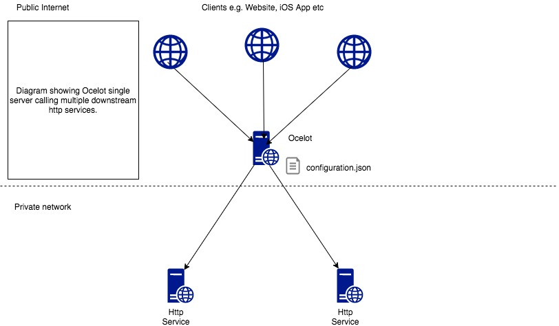
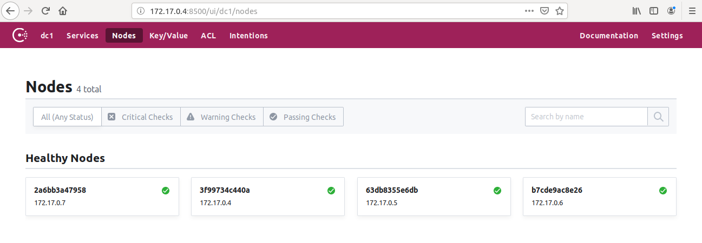
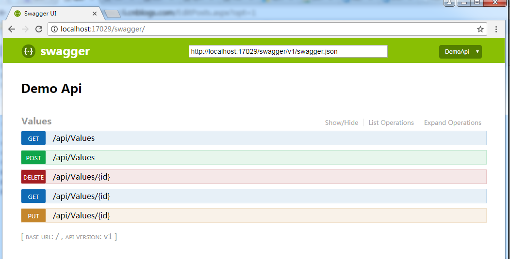
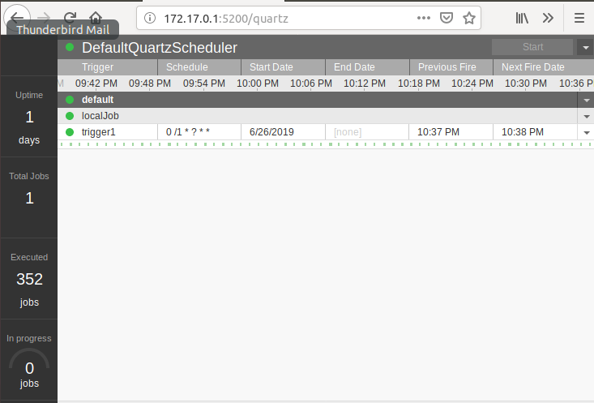
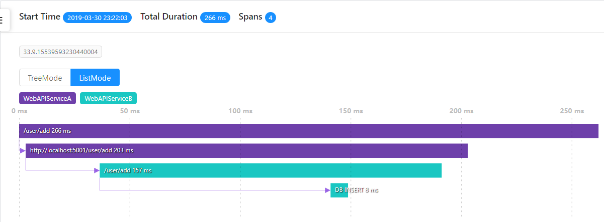

# API服务框架

## 程序结构&代码结构&分层思想

## Ocelot——API网关

Ocelot是一个用.NET Core实现并且开源的API网关，它功能强大，包括了：路由、请求聚合、服务发现、认证、鉴权、限流熔断、并内置了负载均衡器与Service Fabric、Butterfly Tracing集成。




## Consul——服务注册与发现

1、在Docker中安装Consul
```bash
docker pull consul
```

2、启动Consul服务
```bash
docker run -d --name=dev-consul -e CONSUL_BIND_INTERFACE=eth0 consul

docker run -d --name=dev-consul2 -e CONSUL_BIND_INTERFACE=eth0 consul agent -dev -join=172.17.0.4

docker run -d --name=dev-consul3 -e CONSUL_BIND_INTERFACE=eth0 consul agent -dev -join=172.17.0.4

docker run -d --name=dev-consul-client -e CONSUL_BIND_INTERFACE=eth0 consul agent -retry-join=172.17.0.4
```

3、Consul管理界面



## Dapper——轻量级ORM框架

Dapper是.Net下的一个轻量级ORM框架.在小型工具向的项目下,使用Dapper会使数据库操作层代码更加优雅。

> 1.Insert操作

```csharp
IDbConnection conn = new SqlConnection(connectionString);
//Insert
string insetSql = "INSERT dbo.BAS_NAME(ID, NAME, OTHER, DATE)VALUES(@ID, @NAME, @OTHER, @DATE)";
BAS_NAME nameInfo = new BAS_NAME();
nameInfo.ID = 0;
nameInfo.NAME = "小王";
nameInfo.OTHER = string.Empty;
nameInfo.DATE = DateTime.Now;
var result = conn.Execute(insetSql, nameInfo);

Console.Write(result);
Console.ReadKey();
```

> 2.Update操作

```csharp
BAS_NAME nameInfo = new BAS_NAME();
nameInfo.ID = 0;
nameInfo.NAME = "小王233";
nameInfo.OTHER = "233";
nameInfo.DATE = DateTime.Now;

string upDateSql = " UPDATE dbo.BAS_NAME SET NAME = @NAME,OTHER= @OTHER,[DATE] = @DATE WHERE ID = @ID";

var result = conn.Execute(upDateSql, nameInfo);
```
> 3.Select操作

```csharp
string selectSql = "SELECT * FROM BAS_NAME";
List<BAS_NAME> basNameList = conn.Query<BAS_NAME>(selectSql).ToList();

selectSql = "SELECT * FROM BAS_NAME WHERE ID = @ID";
basNameList = conn.Query<BAS_NAME>(selectSql,new { ID = 1 }).ToList();
```
> 4.Delete操作

```csharp
var result = conn.Execute("DELETE FROM dbo.BAS_NAME WHERE ID = @ID", new { ID = 0 });
```
## NLog——日志记录

NLog 支持以下的 记录日志等级：

- Trace - 非常详细的日志，包含最详尽的信息，例如协议的有效载荷. 该日志等级通常仅在开发过程中被使用；

- Debug - 调试信息，详尽信息次于 Trace ，在生产环境中通常不启用；

- Info - 信息消息， 通常在生产环境中通常启用；

- Warn - 警告信息，通常用于非关键问题，这些问题可以恢复，或者是暂时的故障；

- Error - 错误信息 - 多数情况下记录Exceptions（异常）信息；

- Fatal - 非常严重的错误！

```csharp
public class MyClass
{
  private static NLog.Logger logger = NLog.LogManager.GetCurrentClassLogger();

  public void MyMethod1()
  {
    logger.Trace("Sample trace message");
    logger.Debug("Sample debug message");
    logger.Info("Sample informational message");
    logger.Warn("Sample warning message");
    logger.Error("Sample error message");
    logger.Fatal("Sample fatal error message");

    // alternatively you can call the Log() method
    // and pass log level as the parameter.
    logger.Log(LogLevel.Info, "Sample informational message");
  }
}
```

## Swagger——API文档生成

Swagger 是一款RESTFUL接口的、基于YAML、JSON语言的文档在线自动生成、代码自动生成的工具。



## Quartz——作业调度

quartz是一个功能丰富的开源的任务调用系统，它可以创建简单或者复杂的几十、几百、甚至成千上万的job。此外，quartz调度器还支持JTA事务和集群。




## SkyWalking——分布式追踪系统

SkyWalking 的核心是数据分析和度量结果的存储平台，通过 HTTP 或 gRPC 方式向 SkyWalking Collecter 提交分析和度量数据，SkyWalking Collecter 对数据进行分析和聚合，存储到 Elasticsearch、H2、MySQL、TiDB 等其一即可，最后我们可以通过 SkyWalking UI 的可视化界面对最终的结果进行查看。Skywalking 支持从多个来源和多种格式收集数据：多种语言的 Skywalking Agent 、Zipkin v1/v2 、Istio 勘测、Envoy 度量等数据格式。


