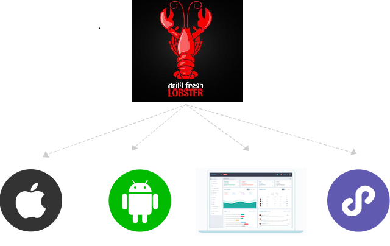
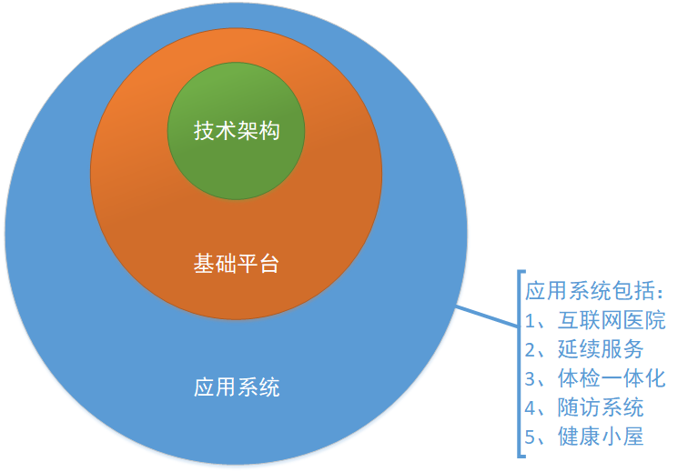
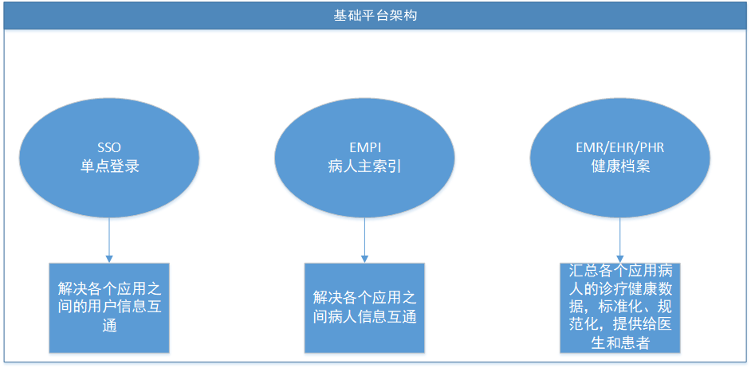
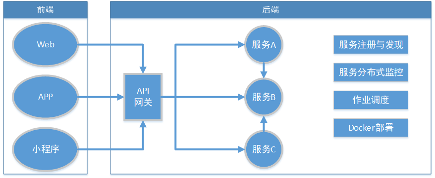

# 互联网产品技术开发平台介绍(Lobster)

> 1、如果开发一个新的互联网产品，就可以使用Lobster作为技术平台，快速开发Web系统、小程序、APP等。无需浪费太多时间再技术选型、技术架构搭建等上面，让团队立马进入产品业务功能开发。

> 2、Lobster包括Web开发、APP开发、小程序开发、Winform客户端开发等。
后端技术采用.netcore，支持微服务、分布式技术、Docker部署等。
前端技术，Web采用LayUI，小程序采用微信小程序，APP采用H5+SDK。

> 3、Lobster还收集一些公共组件，包括消息推送、视频通讯、IM聊天等。还提供一些核心业务接入，如SSO、病人主索引、支付、CA认证等。

> 4、团队开发管理建议采用敏捷开发，所以Lobster还提供一些敏捷指导，包括敏捷思维、敏捷实践和敏捷工具。

查看技术文档：[https://docs.efwplus.cn/](https://docs.efwplus.cn/)

从Github上获取Demo：[https://github.com/Internethospital/LobsterDemo](https://github.com/Internethospital/LobsterDemo)

## 架构图

> 互联网医院架构

> 基础平台架构

> Lobster微服务技术架构

