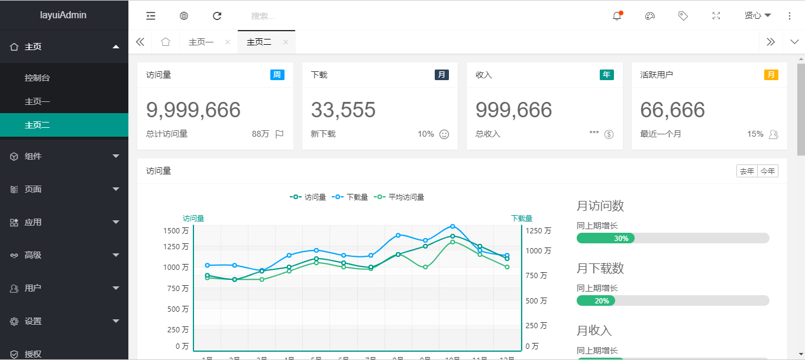

# Web开发框架

## Web开发介绍

Web开发就是采用ASP.NET Core MVC技术开发，但是不直接操作数据库，而是通过调用后台服务。

ASP.NET Core MVC 是使用“模型-视图-控制器”设计模式构建 Web 应用和 API 的丰富框架。

ASP.NET Core MVC 框架是轻量级、开源、高度可测试的演示框架，并针对 ASP.NET Core 进行了优化。
ASP.NET Core MVC 提供一种基于模式的方式，用于生成可彻底分开管理事务的动态网站。 它提供对标记的完全控制，支持 TDD 友好开发并使用最新的 Web 标准。

https://docs.microsoft.com/zh-cn/aspnet/core/mvc/overview?view=aspnetcore-2.2

## LayUI介绍

layui（谐音：类UI) 是一款采用自身模块规范编写的前端 UI 框架，遵循原生 HTML/CSS/JS 的书写与组织形式，门槛极低，拿来即用。其外在极简，却又不失饱满的内在，体积轻盈，组件丰盈，从核心代码到 API 的每一处细节都经过精心雕琢，非常适合界面的快速开发。layui 首个版本发布于2016年金秋，她区别于那些基于 MVVM 底层的 UI 框架，却并非逆道而行，而是信奉返璞归真之道。准确地说，她更多是为服务端程序员量身定做，你无需涉足各种前端工具的复杂配置，只需面对浏览器本身，让一切你所需要的元素与交互，从这里信手拈来。

https://www.layui.com/doc/

## 关于前后端分离
