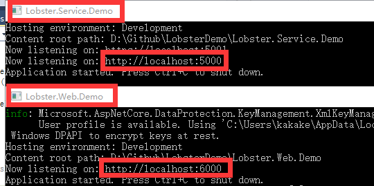
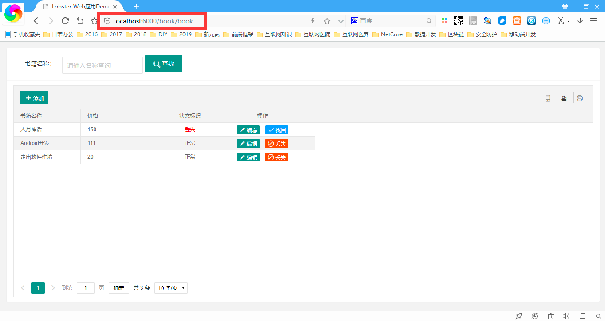
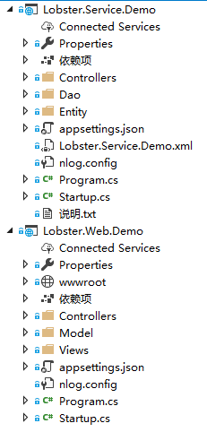
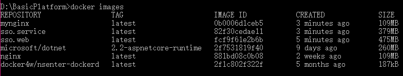
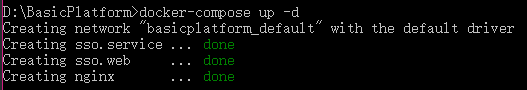
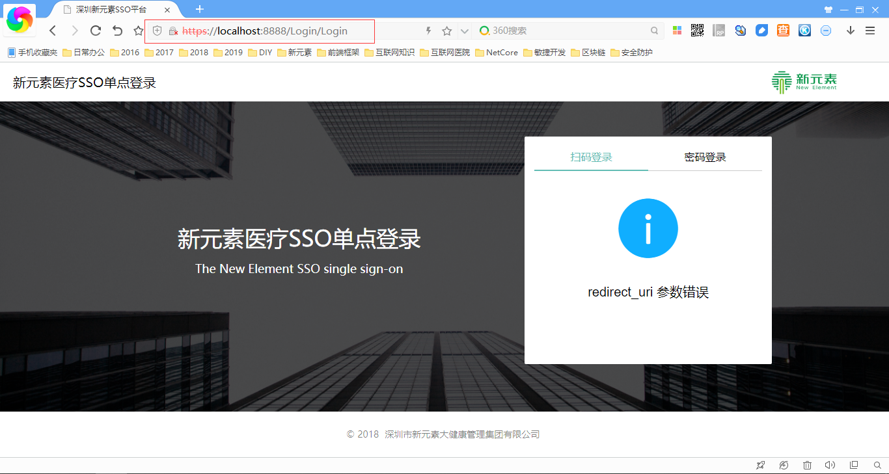

# Web开发起步

## 开发环境搭建
- 安装Visual Studio Community 2017

下载地址：https://visualstudio.microsoft.com/zh-hans/vs/older-downloads/

- 安装 .Net Core 2.2

由于VS2017中默认内置是.Net Core 2.1，所以.Net Core 2.2需要单独安装，也可以直接安装最新的Visual Studio Community 2019。

## 获取Web项目实例源代码
- 1、从GitHub上下载框架源代码

```bash
git clone https://github.com/Internethospital/LobsterDemo.git
```

- 2、在SqlServer2012数据库上建表

```sql
CREATE TABLE [dbo].[Books](
	[Id] [int] IDENTITY(1,1) NOT NULL,
	[BookName] [varchar](50) NULL,
	[BuyPrice] [decimal](18, 2) NULL,
	[BuyDate] [datetime] NULL,
	[Flag] [smallint] NULL,
	[ImageData] [image] NULL,
	[WorkId] [int] NULL,
 CONSTRAINT [PK__Books__3214EC0755209ACA] PRIMARY KEY CLUSTERED
(
	[Id] ASC
)WITH (PAD_INDEX = OFF, STATISTICS_NORECOMPUTE = OFF, IGNORE_DUP_KEY = OFF, ALLOW_ROW_LOCKS = ON, ALLOW_PAGE_LOCKS = ON) ON [PRIMARY]
) ON [PRIMARY] TEXTIMAGE_ON [PRIMARY]
```

- 3、启动Web项目





- 4、关键代码讲解

> 代码工程结构



工程分位两个项目，Lobster.Service.Demo为提供的API服务，Lobster.Web.Demo为MVC的Web程序，Lobster.Web.Demo不直接访问数据库，而是通过调用Lobster.Service.Demo中的服务实现业务逻辑。也就是说Lobster.Service.Demo为服务提供者，Lobster.Web.Demo是服务消费者。

> Lobster.Service.Demo项目的BookController

```csharp
    /// <summary>
    /// 书籍管理
    /// </summary>
    [ApiVersion("1.0")]
    [EnableCors("AllowSameDomain")]//启用跨域
    [Route("demo/v{version:apiVersion}/[controller]/[action]")]
    [ApiController]
    public class BookController : ApiControllerBase
    {
        private readonly IApiHelper _apiHelper;//api辅助

        /// <summary>
        /// 应用管理
        /// </summary>
        /// <param name="apiHelper"></param>
        public BookController(IApiHelper apiHelper)
        {
            _apiHelper = apiHelper;
        }

        /// <summary>
        /// 获取书籍
        /// </summary>
        /// <returns></returns>
        [HttpGet]
        public ActionResult<Response> GetBookData(int page, int limit,string bookName)
        {
            var response = new Response();
            PageInfo pageinfo = new PageInfo(limit, page);
            pageinfo.OrderBy = new string[] { "Id" };
            var data = _apiHelper.NewDao<BookDao>().GetBookData(bookName, ref pageinfo);

            response.AddData("data", data);
            response.AddData("count", pageinfo.totalRecord);
            return response;
        }
        /// <summary>
        /// 保存书籍
        /// </summary>
        /// <returns></returns>
        [HttpPost]
        public ActionResult<Response> SaveBook([FromBody]Book book)
        {
            var response = new Response();

            var result = NewDao<AbstractDao>().Save<Book>(book);
            response.AddData("result", result);

            return response;
        }

        /// <summary>
        /// 删除书籍
        /// </summary>
        /// <returns></returns>
        [HttpPost]
        public ActionResult<Response> DeleteBook([FromForm]int Id)
        {
            var response = new Response();

            var result = NewDao<BookDao>().DeleteBook(Id);
            response.AddData("result", result);
            return response;
        }
    }
```

> Lobster.Service.Demo项目的BookDao

```csharp
   /// <summary>
   /// Demo DAO
   /// </summary>
   public class BookDao : AbstractDao
   {
       /// <summary>
       /// 获取书籍数据
       /// </summary>
       /// <param name="bookName">查询名称</param>
       /// <param name="pageinfo">分页对象</param>
       /// <returns></returns>
       public dynamic GetBookData(string bookName, ref PageInfo pageinfo)
       {
           string strSql = string.Format(@"select * from books where bookname like '%{0}%'", bookName);
           strSql = SqlPage.FormatSql(DatabaseType.SqlServer, strSql, pageinfo, connection);
           return connection.Query<Entity.Book>(strSql);
       }

       /// <summary>
       /// 删除书籍
       /// </summary>
       /// <param name="Id">Id</param>
       /// <returns></returns>
       public bool DeleteBook(int Id)
       {
           string strSql = @"update books set flag=1 where id=@Id";
           return connection.Execute(strSql, new { Id = Id }) > 0;
       }
   }
```

> Lobster.Service.Demo项目的Book

实体，支持映射到数据库中的表，采用Dapper实现ORM操作。

```csharp
    [Table("Books")]
    public class Book
    {

        [Key]
        public int Id { get => _id; set => _id = value; }
        public string BookName { get => _bookName; set => _bookName = value; }
        public decimal BuyPrice { get => _buyPrice; set => _buyPrice = value; }
        public int Flag { get => _flag; set => _flag = value; }
        public int WorkId { get => _workId; set => _workId = value; }


        private int _id;
        private string _bookName;
        private decimal _buyPrice;
        private int _flag;
        private int _workId;
    }
```

> Lobster.Web.Demo项目的BookController

```csharp
    /// <summary>
    /// 书籍管理
    /// </summary>
    public class BookController : WebControllerBase
    {

        public ActionResult Book()
        {
            return View();
        }

        public ActionResult BookForm()
        {
            return View();
        }

        /// <summary>
        /// 获取应用数据
        /// </summary>
        /// <returns></returns>
        [HttpGet]
        public object GetBookList([FromQuery(Name = "page")]string page, [FromQuery(Name = "limit")]string limit, [FromQuery(Name = "txtname")]string bookName)
        {
            //实例化RestRequest
            var request = new RestRequest("/demo/v1/book/getbookdata");
            //增加参数
            request.AddQueryParameter("page", page);
            request.AddQueryParameter("limit", limit);
            request.AddQueryParameter("bookName", bookName);
            //执行请求
            var responseData = RestHelper.ExecuteGet<Response>("Lobster.Service.Demo", request);

            if (responseData != null)
            {
                var data = responseData.GetData<dynamic>("data");
                var count = Convert.ToInt32(responseData.GetData<string>("count"));
                if (count > 0)
                    return ToTableJson(count, data);
                else
                    return new Response(1, "无数据");
            }
            else
            {
                return new Response(1, "无数据");
            }
        }

        [HttpPost]
        public object SaveBook([FromForm]Book book)
        {
            //实例化RestRequest
            var request = new RestRequest("/demo/v1/book/savebook");
            //增加参数
            request.AddJsonBody(book);
            //执行请求
            var responseData = RestHelper.ExecutePost<Response>("Lobster.Service.Demo", request);
            return responseData;
        }

        [HttpPost]
        public object DeleteBook([FromForm]int Id)
        {
            //实例化RestRequest
            var request = new RestRequest("/demo/v1/book/deletebook");
            //增加参数
            request.AddParameter("Id", Id);
            //执行请求
            var responseData = RestHelper.ExecutePost<Response>("Lobster.Service.Demo", request);

            return responseData;
        }
    }
```

> Lobster.Web.Demo项目的Book.cshtml

```html
@section header{
    <link id="layuicss-layer" rel="stylesheet" href="/uiframe/layuiadmin/layui/css/modules/layer/default/layer.css?v=3.1.1" media="all">
    <link href="../../uiframe/layuiadmin/layui/css/modules/layui-icon-extend/iconfont.css" rel="stylesheet" />
}
<style>
    .layui-btn {
        vertical-align: top;
    }
</style>

<div class="layui-fluid">
    <div class="layui-card">
        <div class="layui-form layui-card-header layuiadmin-card-header-auto">
            <div class="layui-input-inline">
                <label class="layui-form-label">书籍名称：</label>
                <div class="layui-input-inline">
                    <input type="text" name="txtName" placeholder="请输入名称查询" autocomplete="off" class="layui-input">
                </div>
            </div>
            <div class="layui-input-inline">
                <button class="layui-btn layuiadmin-btn-useradmin" lay-submit lay-filter="LAY-app-front-search" id="btnSearch">
                    <i class="layui-icon layui-icon-search layuiadmin-button-btn"></i>查找
                </button>
            </div>
        </div>

        <div class="layui-card-body">
            <script id="toolbar" type="text/html">
                <div class="layui-btn-group">
                    <button class="layui-btn layui-btn-sm" lay-event="add"><i class="layui-icon layui-icon-add-1"></i>添加</button>
                </div>
            </script>
            <table id="bookTable" lay-filter="bookTable"></table>
        </div>
    </div>
</div>

<script type="text/html" id="flagTpl">
    {{#  if(d.Flag == '1'){ }}
    <span style="color:red;">丢失</span>
    {{#  } else { }}
    正常
    {{#  } }}
</script>

<script type="text/html" id="option">
    <a class="layui-btn layui-btn-xs" lay-event="edit"><i class="layui-icon layui-icon-edit"></i>编辑</a>
    {{#  if(d.Flag == '0'){ }}
    <a class="layui-btn layui-btn-danger layui-btn-xs" lay-event="disable"><i class="layui-icon layui-extend-stop"></i>丢失</a>
    {{#  } else { }}
    <a class="layui-btn layui-btn-normal layui-btn-xs" lay-event="enable"><i class="layui-icon layui-icon-ok"></i>找回</a>
    {{#  } }}
</script>

<script>
    layui.config({
        base: '/uiframe/layuiadmin/' //静态资源所在路径
    }).extend({
        index: 'lib/index' //主入口模块
    });
    layui.extend({
        book: '{/}/userJs/book' // {/}的意思即代表采用自有路径，即不跟随 base 路径
    })
    layui.use(['index', 'book'], function () { });
</script>
```

> Lobster.Web.Demo项目的book.js

```js
/**

 @Name：书籍DEMO
 @Author：kakake
 @Date：2019-03-12

 */
layui.define(['layer', 'form', 'element', 'table', 'index'], function (exports) {
    var layer = layui.layer;
    var form = layui.form;
    var element = layui.element;
    var table = layui.table;
    var $ = layui.$;
    var admin = layui.admin;
    var setter = layui.setter;

    //表格绑定
    booktable = table.render({
        elem: '#bookTable',
        where: {
            //token: layui.data(setter.tableName)['token'],
            txtname: $("#txtName option:selected").text()  //获取文本值
        },
        height: 'full-130',
        cellMinWidth: 80,
        size: 'sm',
        toolbar: '#toolbar',
        url: '/book/getbooklist',
        page: true,
        even: true,
        cols: [[
            { width: "70", field: 'Id', title: 'ID', fixed: 'left', hide: true },
            { width: "150", field: 'BookName', title: '书籍名称' },
            { width: "200", field: 'BuyPrice', title: '价格' },
            { width: "90", field: 'Flag', title: '状态标识', align: 'center', templet: '#flagTpl' },
            { width: "235", title: '操作', fixed: 'right', align: 'center', toolbar: '#option' }   //操作script的id                  
        ]]
    });

    //查找reload,通过条件，查询网格的table重载数据显示到界面
    form.on("submit(LAY-app-front-search)", function (data) {
        booktable.reload({
            where: {
                //token: layui.data(setter.tableName)['token'],
                txtname: data.field.txtName
            },
            page: {
                curr: 1
            }
        });
    });

    //添加按钮的点击事件
    table.on('toolbar(bookTable)', function (obj) {
        switch (obj.event) {
            case 'add':
                layer.open({
                    type: 2
                    , title: '新增书籍'
                    , content: '/book/bookform'
                    , maxmin: true
                    , area: ['680px', '480px']  //宽，高
                    , btn: ['保存', '取消']
                    , btn2: function (index, layero) {
                        $("#LAY-app-form-reset").trigger('click');
                    }
                    , cancel: function () {
                        $("#LAY-app-form-reset").trigger('click');
                    }
                    , yes: function (index, layero) {
                        var iframeWindow = window['layui-layer-iframe' + index],
                            submitID = 'LAY-app-front-submit',
                            submit = layero.find('iframe').contents().find('#' + submitID);
                        //监听提交
                        iframeWindow.layui.form.on('submit(' + submitID + ')', function (data) {
                            var field = data.field; //获取提交的字段
                            var load = layer.msg('正在处理，请稍候', { icon: 16, time: 0, shade: [0.3, '#393D49'] });
                            console.log(field);
                            admin.req({
                                type: 'post',
                                url: '/book/savebook',
                                data: field,
                                done: function (obj) {
                                    layer.msg("保存成功");
                                    //提交 Ajax 成功后，静态更新表格中的数据
                                    booktable.reload(); //数据刷新
                                    layer.close(index); //关闭弹层
                                }
                            });
                        });
                        submit.trigger('click');
                    }
                });
                break;
        };
    });

    //监听行工具事件
    table.on('tool(bookTable)', function (obj) {  //tool是工具条事件名，table原始容器的属性
        var data = obj.data;//当前行数据
        var layEvent = obj.event;//获得lay-event的值
        if (obj.event === "edit") {
            layer.open({
                type: 2
                , title: '编辑书籍'
                , content: '/book/bookform'
                , area: ['680px', '480px']  //宽，高
                , btn: ['保存', '取消']
                , success: function (layero, index) {
                    setTimeout(function () {
                        //执行完毕，layer的动画一般是执行500毫秒
                        var iframeWin = window['layui-layer-iframe' + index];
                        var othis = layero.find('iframe').contents().find("#formBook");

                        othis.find('input[name="Id"]').val(data.Id);
                        othis.find('input[name="BookName"]').val(data.BookName);
                        othis.find('input[name="BuyPrice"]').val(data.BuyPrice);
                        othis.find('input[name="Flag"]').val(data.Flag);
                        othis.find('input[name="WorkId"]').val(data.WorkId);

                    }, 500);
                }
                , btn2: function (index, layero) {
                    $("#LAY-app-form-reset").trigger('click');
                }
                , cancel: function () {
                    $("#LAY-app-form-reset").trigger('click');
                }
                , yes: function (index, layero) {
                    var iframeWindow = window['layui-layer-iframe' + index]
                        , submitID = 'LAY-app-front-submit'  //子界面的保存，取消按钮的lay-filter
                        , submit = layero.find('iframe').contents().find('#' + submitID);

                    //监听提交
                    iframeWindow.layui.form.on('submit(' + submitID + ')', function (data) {
                        var field = data.field; //获取提交的字段

                        var load = layer.msg('正在处理，请稍候', { icon: 16, time: 0, shade: [0.3, '#393D49'] });
                        admin.req({
                            type: 'post'
                            , url: '/book/savebook'
                            , data: field
                            , done: function (res) {
                                layer.msg("保存成功");
                                //提交 Ajax 成功后，静态更新表格中的数据
                                booktable.reload(); //数据刷新
                                layer.close(index); //关闭弹层
                            }
                        });

                    });
                    submit.trigger('click');
                }
            });
        }

        if (obj.event === "disable" || obj.event === "enable") {
            // 启用停用机构
            var confirm_msg = "";
            var status = 0;
            if (data.Flag == 0) {
                confirm_msg = "确认停用么?";
                status = 1;
            }
            else {
                confirm_msg = "确认启用么?";
                status = 0;
            }

            layer.confirm(confirm_msg, { icon: 3, title: "提示" },
                function (index) {
                    admin.req({
                        type: "post",
                        url: "/book/deletebook",
                        data: {
                            //token: layui.data(setter.tableName)["token"],
                            Id: data.Id
                        },
                        done: function (res) {
                            booktable.reload();// 数据刷新
                            layer.close(index); //关闭弹层
                        }
                    });
                });
        }
    });

    exports('book', {})
});

```

## 在Docker中运行Web项目
- 1、用dotnet命令编译源代码并发布

```bash
dotnet restore "D:/BasicPlatform/SSO.Web/SSO.Web.csproj"
dotnet restore "D:/BasicPlatform/SSO.Service/SSO.Service.csproj"
dotnet build "D:/BasicPlatform/SSO.Web/SSO.Web.csproj"
dotnet build "D:/BasicPlatform/SSO.Service/SSO.Service.csproj"
dotnet publish "D:/BasicPlatform/SSO.Web/SSO.Web.csproj" -o "D:/BasicPlatform/SSO.Web/publish"
dotnet publish "D:/BasicPlatform/SSO.Service/SSO.Service.csproj" -o "D:/BasicPlatform/SSO.Service/publish"
```
- 2、用docker命令编译容器并启动
```bash
docker-compose down --rmi all
docker-compose build
docker-compose up -d
```
> docker编译后查看镜像



> docker启动镜像



> 浏览器访问系统


