# SSO单点登录
## 操作手册
### Sso中心平台地址:https://sso.efwplus.cn:8888/Login/Index
### 一、	创建应用(获取Appkey)
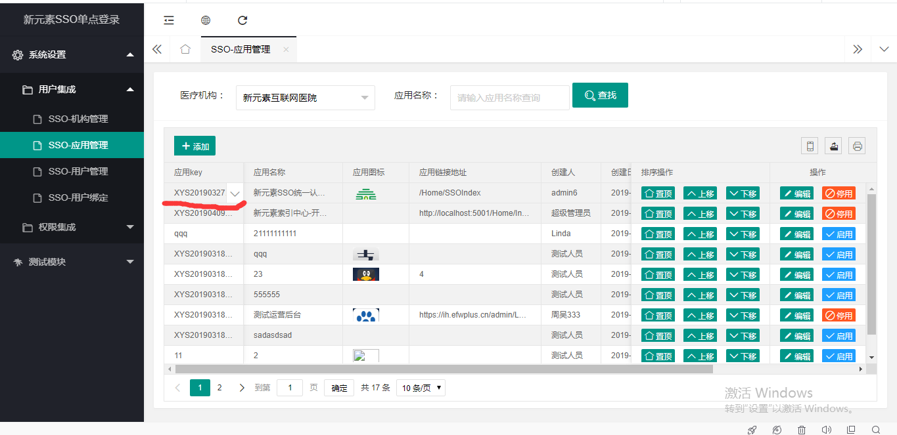
### 二、	用户绑定(绑定应用用户)
#### 1、进入用户绑定页面
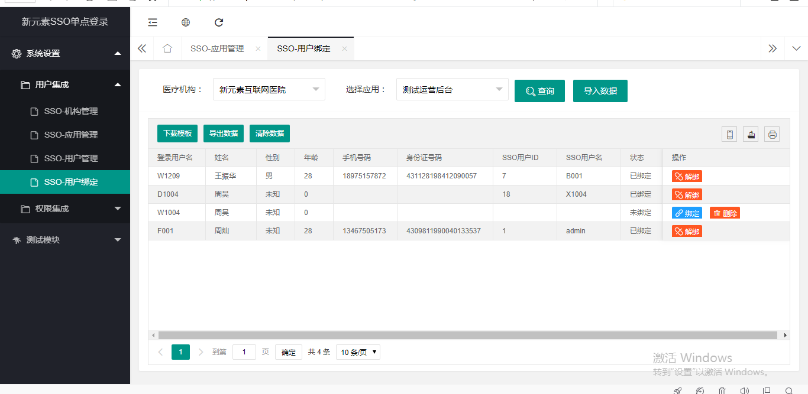
#### 2、下载模板
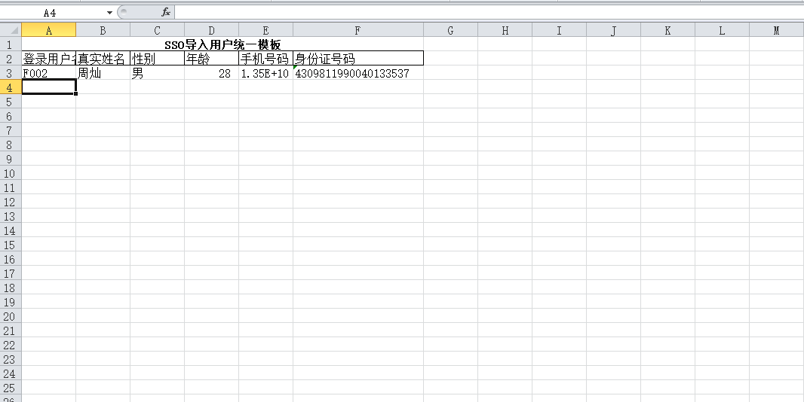
#### 3、导入数据
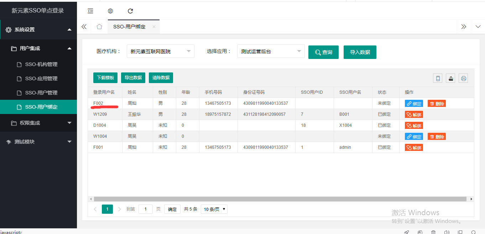
#### 4、绑定用户
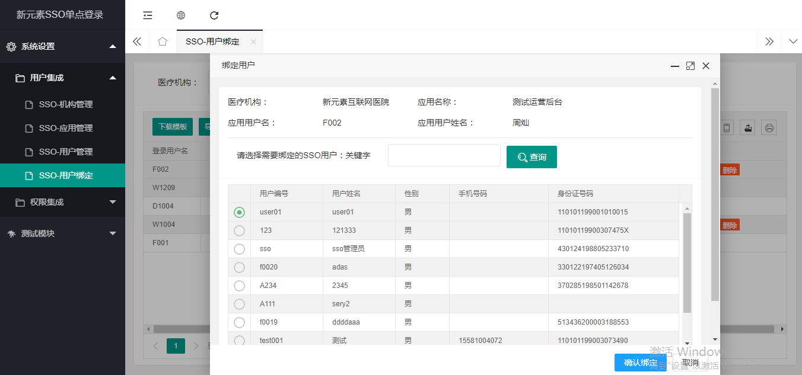
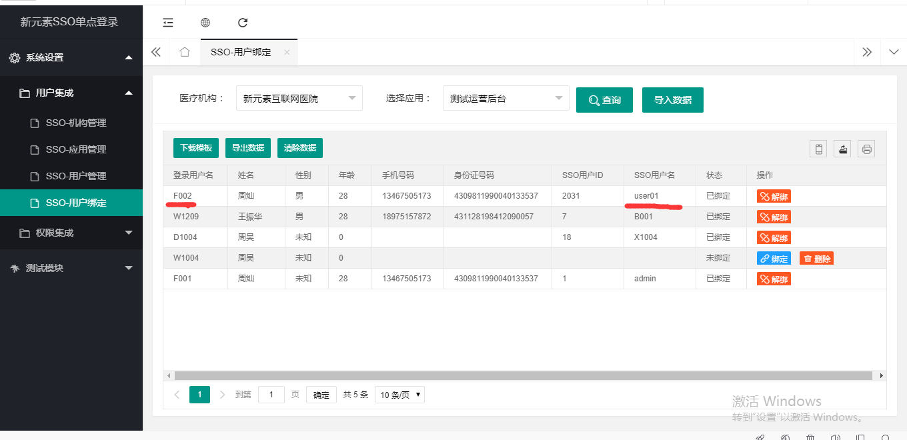
## 对接文档
### 一、登录流程
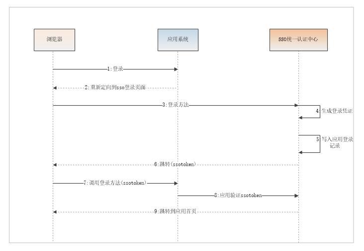
### 二、注销流程
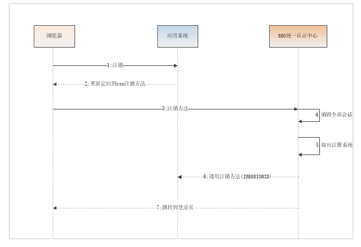
### 三、接口接入
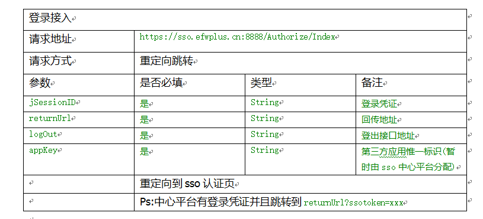
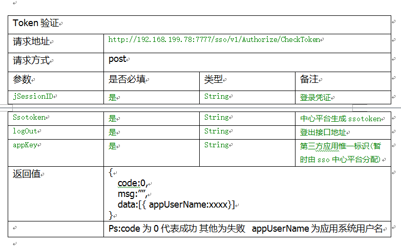
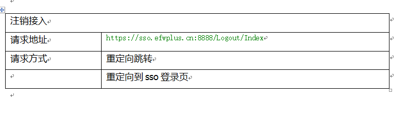
## 单系统权限设计

## SSO单点登录权限设计

## SSO单点登录业务流程 测试测试
